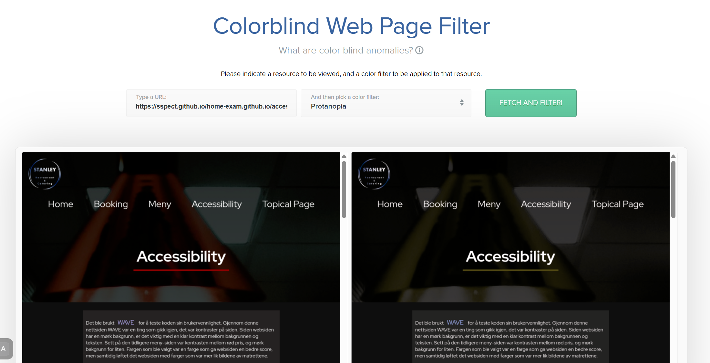
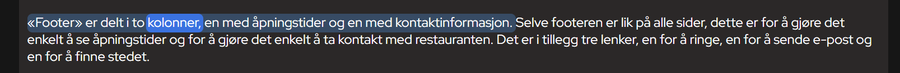
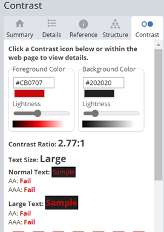
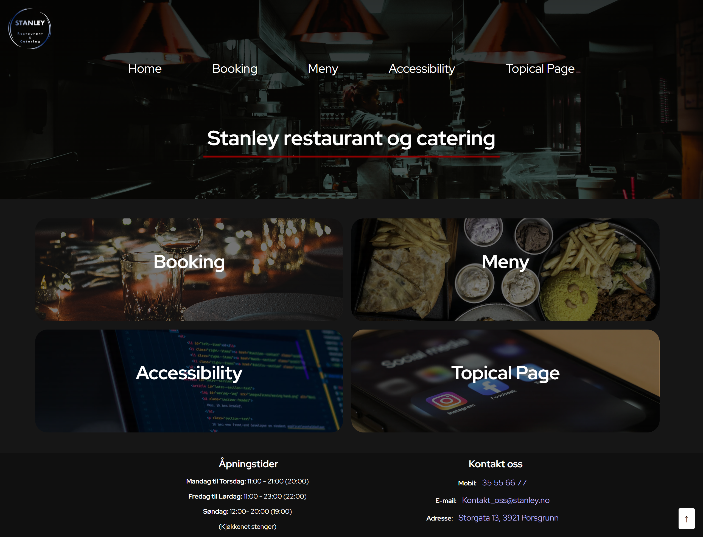
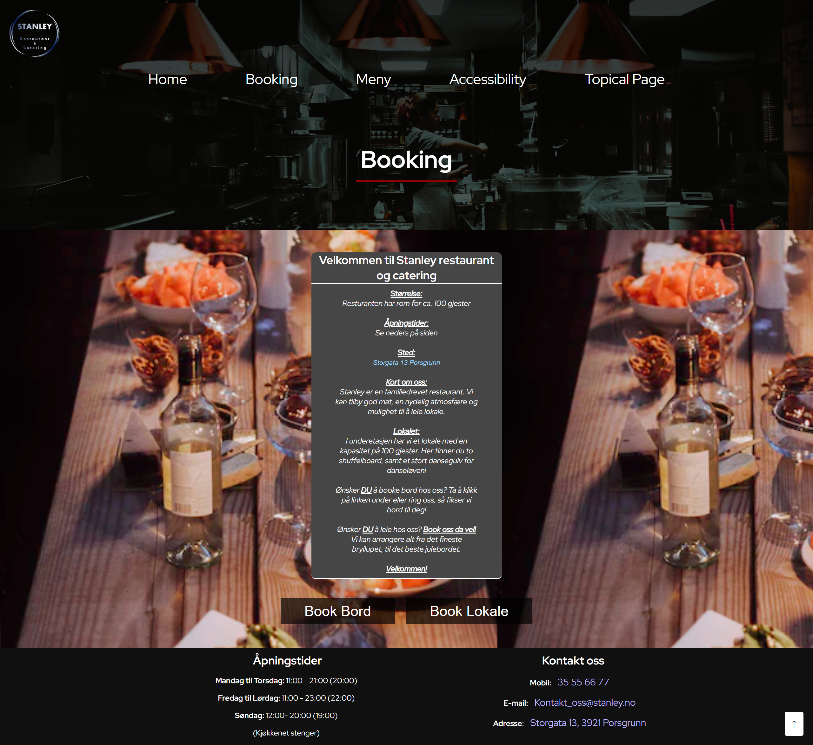
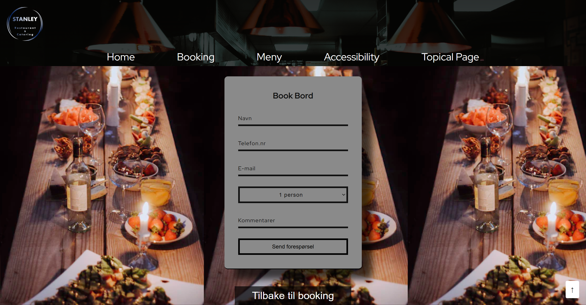
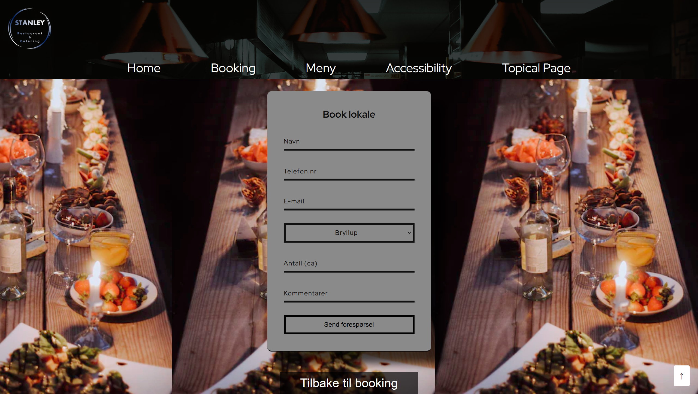
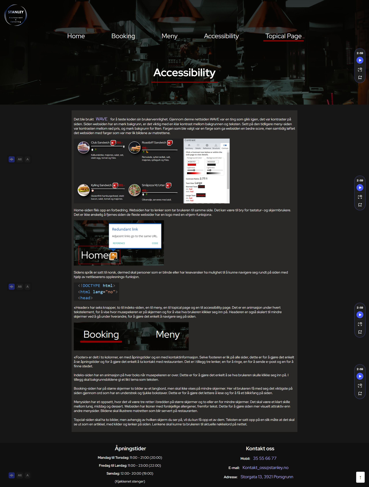
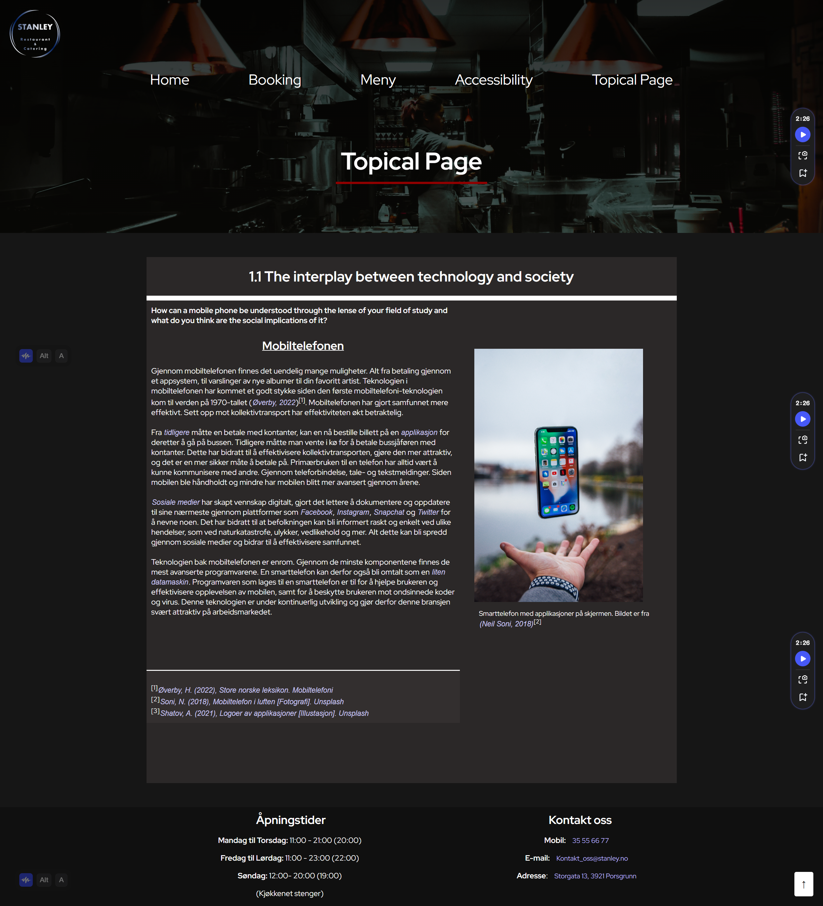

# exam — DATA1200 Inclusive Web Design

[logo](img/logo.png)
**See website**: https://sspect.github.io/home-exam.github.io/index.html  
**Course**: DATA1200 — Inclusive Web Design  
**Repository**: [home-exam.github.io](https://github.com/Sspect/home-exam.github.io)  
**Grading Sheet**: [DATA1200 Grading sheet for examiners.pdf](pdfs/DATA1200%20Grading%20sheet%20for%20examiners.pdf)  
**Final Assignment**: [Final assignment DATA1200 fall 2022.pdf](pdfs/Final%20assignment%20DATA1200%20fall%202022.pdf)  

 

## About
This repository hosts our exam, a static website built for the [DATA1200](https://student.oslomet.no/en/studier/-/studieinfo/emne/DATA1200/2021/H%C3%98ST) Inclusive Web Design course at OsloMet. It's implemented using HTML and CSS, with a focus on accessibility and inclusive design principles.

 

## Course
- DATA1200, also known in Norwegian as _Webutvikling og inkluderende design_, is a 5 ECTS course offered in Fall at OsloMet.
- Students learn HTML and CSS, gain familiarity with development tools and version control, and are introduced to universal accessibility and collaboration practices.

 

## Tools

### [Color Blindness Simulator](https://www.toptal.com/designers/colorfilter)  
A tool to simulate how websites and designs appear to users with different types of color blindness.  

---

### [Screen Reader (Chrome Extension)](https://chromewebstore.google.com/detail/screen-reader/kgejglhpjiefppelpmljglcjbhoiplfn?hl=en)  
A screen reader extension for Chrome that reads web content aloud for visually impaired users.  

---

### [WAVE Web Accessibility Evaluation Tool](https://wave.webaim.org/)  
A web accessibility evaluation tool that analyzes web pages for WCAG compliance and highlights issues.  

 

## 📄 Website Pages

### [index.html](https://sspect.github.io/home-exam.github.io/index.html)  
The homepage introduces Stanley restaurant and catering with a clear header and animated navigation boxes linking to the main sections. It also includes practical information like opening hours, contact details, and address in a consistent footer.  

---

### [booking.html](https://sspect.github.io/home-exam.github.io/booking.html)  
An overview page for reservations, highlighting the restaurant’s capacity, location in Porsgrunn, and warm atmosphere. Visitors can quickly choose to book a table or the full venue via two clear buttons.  

---

### [bookbord.html](https://sspect.github.io/home-exam.github.io/bookbord.html)  
A simple table booking form where guests enter contact details, party size, and comments. A confirmation alert ensures requests feel immediate and user-friendly.  

---

### [bookLokale.html](https://sspect.github.io/home-exam.github.io/bookLokale.html)  
A venue booking form tailored for larger events such as weddings, birthdays, and company parties. Guests select event type, number of attendees, and extra requirements before sending a request.  

---

### [meny.html](https://sspect.github.io/home-exam.github.io/meny.html)  
The menu is divided into **Lunch**, **Dinner**, and **Dessert**, each with appetizing images, prices, and allergen icons. The design adapts from multi-column layouts on large screens to single-column on small devices.  

---

### [accessibility.html](https://sspect.github.io/home-exam.github.io/accessibility.html)  
Documents accessibility testing with [WAVE](https://wave.webaim.org/) and improvements like better color contrast, screen reader navigation, and responsive design choices. Screenshots highlight key fixes.  

---

### [topical_page.html](https://sspect.github.io/home-exam.github.io/topical_page.html)  
An article-style page exploring the impact of mobile phones on society. It mixes text, references, and external links with images of smartphones and social media. Unlike the other pages, it has a distinct, academic look.  

